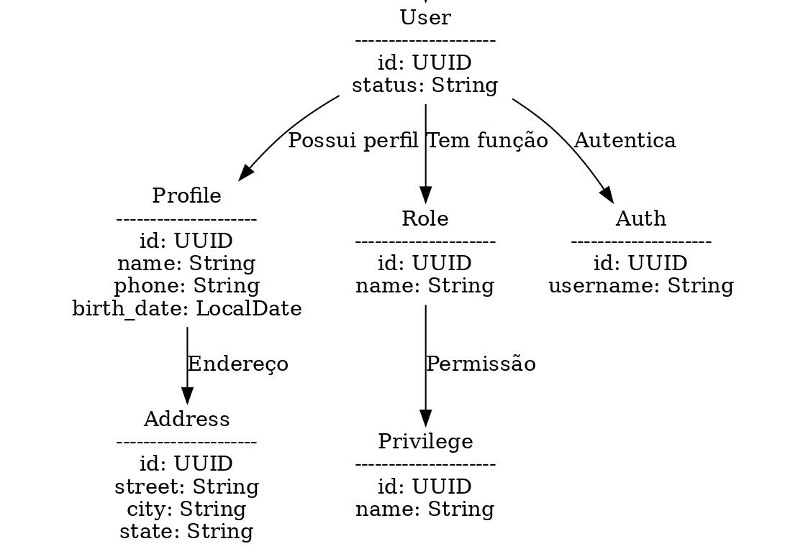
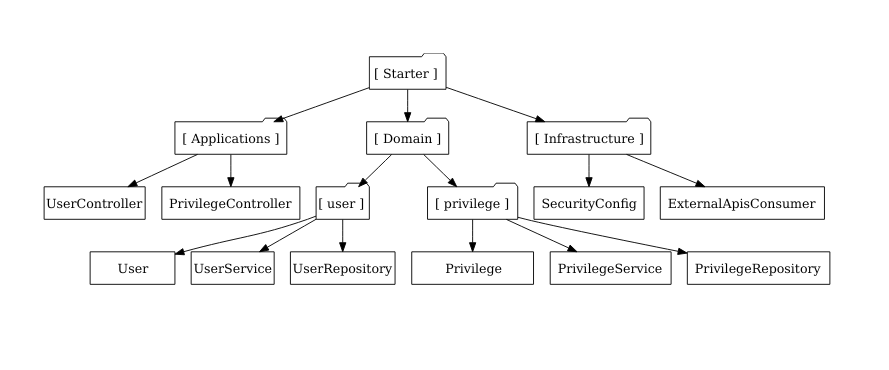

<h1 align="center">
  Starter API 🏂🏼
</h1>

<p align="center">
  <a href="#-apresentacao">Apresentação</a>&nbsp;&nbsp;&nbsp;|&nbsp;&nbsp;&nbsp;
  <a href="#-tecnologias-utilizadas">Tecnologias</a>&nbsp;&nbsp;&nbsp;|&nbsp;&nbsp;&nbsp;
  <a href="#-pre-configuracoes">Pré-Configurações</a>&nbsp;&nbsp;&nbsp;|&nbsp;&nbsp;&nbsp;
  <a href="#-estrutura-do-projeto">Estrutura do Projeto</a>&nbsp;&nbsp;&nbsp;|&nbsp;&nbsp;&nbsp;
  <a href="#-instalacao-e-configuracao">Instalação</a>&nbsp;&nbsp;&nbsp;|&nbsp;&nbsp;&nbsp;
  <a href="#-contribuicao">Contribuição</a>&nbsp;&nbsp;&nbsp;|&nbsp;&nbsp;&nbsp;
  <a href="#-licenca">Licença</a>
</p>

## 📌 Apresentação
Starter-API é um projeto desenvolvido em **Spring** que implementa uma variação da **Arquitetura Limpa**, estruturando o sistema em três camadas principais: `Application`, `Domain` e `Infrastructure`. 

## ⚙️ Pré-Configurações
O template inclui a configuração básica do Spring Security e um conjunto de entidades de relacionamento de usuário, seguindo o seguinte padrão:



Também é realizada a configuração padrão dessas entidades no banco de dados através da migração **`V1__initial_schema`**, que, junto das tabelas, adiciona três ROLES iniciais:
- **`ROLE_ADMIN`**
- **`ROLE_MANAGER`**
- **`ROLE_USER`**

As roles seguem esta sequência hierárquica.

## 🏗️ Estrutura do Projeto
O projeto é organizado da seguinte forma:



### **1. Application**
Esta camada é responsável pela interação com os clientes da API e pela orquestração dos casos de uso. Contém:
- **`api`**: Pacote contendo todos os controllers e endpoints da API.
- **`useCase`**: Pacote que agrupa todos os casos de uso (regras de negócio que interagem com a camada `Domain`).

### **2. Domain**
Contém toda a lógica de negócio e entidades do sistema. Inclui:
- **Entidades**: Representação dos objetos de domínio.
- **Services**: Implementação das regras de negócio independentes de frameworks.
- **Repositories**: Interface para abstração do acesso aos dados.

### **3. Infrastructure**
Gerencia as configurações e integrações externas, incluindo:
- **Configurações**: Propriedades do Spring Boot e beans necessários para a infraestrutura.
- **Conexões externas**: Integrações com APIs externas e provedores de serviço.
- **Spring Security**: Configurações de autenticação e autorização para proteger a API.

## 🚀 Tecnologias Utilizadas
- **Java 17+**
- **Spring Boot** (Web, Data JPA, Security, etc.)
- **PostgreSQL / MySQL** (ou outro banco de dados relacional)
- **Flyway** (para controle de versionamento do banco de dados)
- **Docker** (opcional, para facilitar o deploy)

## 📥 Instalação e Configuração

### **1. Clonar o repositório**
```bash
    git clone https://github.com/Edsonalencar/starter-api.git
    cd starter-api
```

### **2. Configurar o Banco de Dados**
Atualize o arquivo `application.properties` (ou `application.yml`) com as credenciais do banco de dados:
```properties
spring.datasource.url=jdbc:postgresql://localhost:5432/minha_base
spring.datasource.username=usuario
spring.datasource.password=senha
```

### **3. Executar o projeto**
```bash
./mvnw spring-boot:run
```
Ou, caso esteja usando Docker Compose:
```bash
docker-compose up -d
```

## 🤝 Contribuição
Se deseja contribuir com o projeto, siga estas etapas:
1. Faça um fork do repositório.
2. Crie uma branch com a feature desejada (`git checkout -b minha-feature`).
3. Faça commit das suas alterações (`git commit -m 'Adicionando nova funcionalidade'`).
4. Envie para o repositório (`git push origin minha-feature`).
5. Abra um Pull Request.

---

## 📜 Licença
Este projeto é licenciado sob a [MIT License](LICENSE).